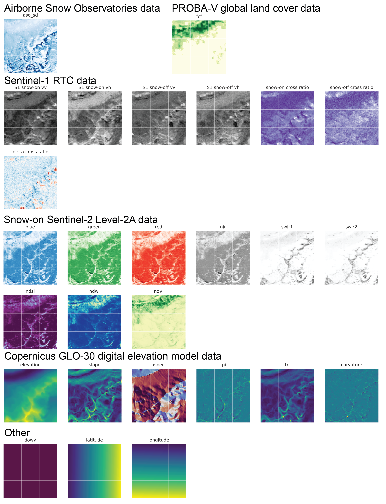

# deep-snow
### Machine learning models for remote sensing snow depth retrieval

### Overview
Seasonal snow provides drinking water for billions, but current global measurements of snow depth lack adequate spatial and temporal resolution for effective resource management--especially in mountainous terrain. This project is focused on training machine learning models to predict snow depth from satellite remote sensing data and accurate airborne lidar snow depth measurements. For more information, see our ["background" notebook](notebooks/background/background.ipynb). 

During the 2023 GeoSMART Hackweek and the 2024 NASA Earth Sciences and UW Hackweek, the deep-snow teams trained convolutional neural networks to predict snow depth. A manuscript describing this work is in preparation. This repo contains code related to that effort as well as tools to predict snow depth from remote sensing imagery using our trained machine learning models. 


### Installation
1) Download and install Miniconda 

2) Set up Mamba
```
$ conda install mamba -n base -c conda-forge
```
3) Clone the repo and set up the environment
```
$ git clone https://github.com/geo-smart/deep-snow.git
$ cd ./deep-snow
$ mamba env create -f environment.yml
$ conda activate deep-snow
```
4) Install the package locally
```
$ pip install -e .
```

### Example usage
See also ["apply_model_full.ipynb"](notebooks/application/apply_model_full.ipynb)
```
from deep_snow.application import predict_sd

# set up arguments 
aoi = {'minlon':-108.1239, 'minlat':37.6393, 'maxlon':-107.5878, 'maxlat':38.0641} # San Juans, CO
target_date = '20240320'
snowoff_date = '20230910'
model_path = '../../weights/quinn_ResDepth_v10_256epochs' # Current latest model
out_dir = '../../data/application'

# predict snow depth
ds = predict_sd(aoi=aoi, target_date=target_date, snowoff_date=snowoff_date, model_path=model_path, out_dir=out_dir)
```

### Data
Our training dataset includes:
- Sentinel-1 RTC backscatter data (snow on and snow off)
- Sentinel-2 imagery (snow on)
- Fractional forest cover
- COP30 digital elevation model
- Airborne Snow Observatory (ASO) lidar snow depth maps

Snow-on Sentinel-1 and 2 data were collected nearby in time to corresponding ASO acquistions. All products were reprojected to the appropriate UTM zone and resampled to a matching 50 m grid. Products were divided up spatially into training, testing, and validation tiles and subset to produce a machine-learning ready dataset. 



### Contributing

Contributions are what make the open source community such an amazing place to learn, inspire, and create. Any contributions you make are greatly appreciated.

If you have a suggestion that would make this better, please fork the repo and create a pull request. You can also simply open an issue with the tag "enhancement". Don't forget to give the project a star! Thanks again!

Fork the Project
Create your Feature Branch (git checkout -b feature/AmazingFeature)
Commit your Changes (git commit -m 'Add some AmazingFeature')
Push to the Branch (git push origin feature/AmazingFeature)
Open a Pull Request

### Collaborators
* Quinn Brencher, gbrench@uw.edu
* Eric Gagliano, egagli@uw.edu

2023 GeoSMART Hackweek team:
- Bareera Mirza
- Ibrahim Alabi
- Dawn URycki
- Taylor Ganz
- Mansa Krishna
- Taryn Black
- Will Rosenbluth
- Yen-Yi Wu
- Fadji Maina
- Hui Gao
- Jacky Chen Xu
- Nicki Shobert
- Kathrine Udell-Lopez
- Abner Bogan (Helper)

2024 NASA Earth Sciences and UW Hackweek team:
- Ekaterina (Katya) Bashkova
- Manda Chasteen
- Sarah Kilpatrick
- Isabella Chittumuri
- Kavita Mitkari
- Shashank Bhushan (Helper)
- Adrian Marziliano (Helper)

### Additional resources or background reading
- [spicy-snow background](https://github.com/SnowEx/spicy-snow/blob/main/contrib/brencher/tutorial/01background.ipynb)
- [spicy-snow paper](https://egusphere.copernicus.org/preprints/2024/egusphere-2024-1018/egusphere-2024-1018.pdf)
- [Lievens et al. (2022) paper](https://tc.copernicus.org/articles/16/159/2022/) 
- [SAR basics](https://asf.alaska.edu/information/sar-information/what-is-sar/)
- [More SAR basics](https://www.earthdata.nasa.gov/learn/backgrounders/what-is-sar)
- [Sentinel-1 SAR](https://sentinels.copernicus.eu/web/sentinel/user-guides/sentinel-1-sar)
- [More on ASF HyP3 RTC](https://hyp3-docs.asf.alaska.edu/guides/rtc_product_guide/)
- [SAR theory from 2022 UNAVCO InSAR class (more advanced)](https://nbviewer.org/github/parosen/Geo-SInC/blob/main/UNAVCO2022/0.8_SAR_Theory_Phenomenology/SAR.ipynb)
