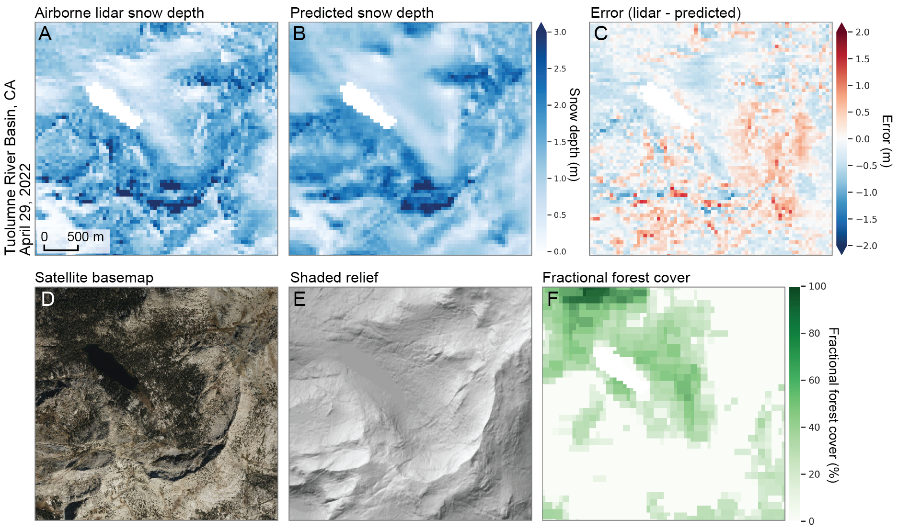
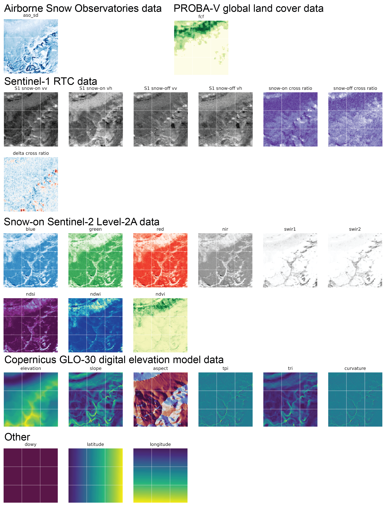
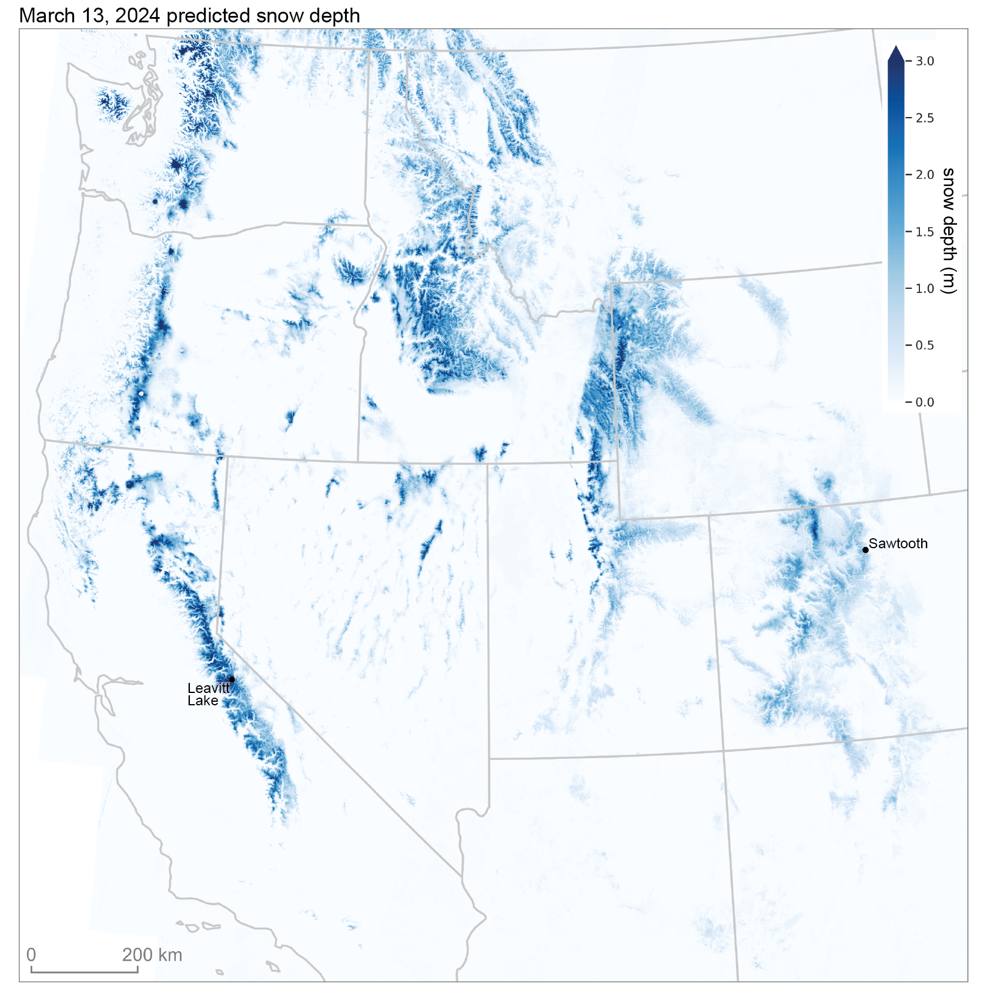

# deep-snow

[](https://github.com/geo-smart/deep-snow/actions/workflows/ci.yml)

Machine learning tools for predicting snow depth from remote sensing data.

## Overview

`deep-snow` provides models and workflows to estimate snow depth from Sentinel-1, Sentinel-2, SNODAS, terrain, and forest-cover inputs.

The focus is on a simple, reproducible pipeline that can be run locally or via GitHub Actions. For model details and evaluation, see [Brencher et al., 2026](https://doi.org/10.2139/ssrn.6557436).


## Choose Your Workflow

There are two main ways to use `deep-snow`. Use GitHub Actions for quick runs or large batch jobs with minimal setup. Use a local install if you want to develop, debug, or build custom workflows with the CLI or Python API.

## Quickstart

### Option 1: GitHub Actions

Fork the repo and run workflows from the Actions tab:

- `batch_predict_sd`: generate one snow-depth map for a target date over an area of interest
- `batch_sd_timeseries`: generate a time series of snow-depth maps over a date range

See [docs/github-actions.md](docs/github-actions.md) for details.

### Option 2: Local install

```bash
git clone https://github.com/geo-smart/deep-snow.git
cd deep-snow
conda install mamba -n base -c conda-forge
mamba env create -f environment.yml
conda activate deep-snow
pip install -e .
```

Make a prediction using the CLI:

```bash
deep-snow predict-sd 20240320 20230910 "-108.20 37.55 -108.00 37.75" 25
```

Add `--predict-swe True` if you also want Hill-model SWE and density outputs alongside depth.

Or make a prediction using the Python API:

```python
from deep_snow import predict_sd

aoi = {
    "minlon": -108.20,
    "minlat": 37.55,
    "maxlon": -108.00,
    "maxlat": 37.75,
}

ds = predict_sd(
    aoi=aoi,
    target_date="20240320",
    snowoff_date="20230910",
    out_dir="data/application",
    predict_swe=True,
)
```

See [docs/local-prediction.md](docs/local-prediction.md) for details.



## Documentation
- [docs/getting-started.md](docs/getting-started.md): first-time setup and navigation
- [docs/choose-a-workflow.md](docs/choose-a-workflow.md): when to use local runs versus GitHub Actions
- [docs/scientific-context.md](docs/scientific-context.md): data sources, model formulation, resolution, validation domain, and limitations
- [docs/github-actions.md](docs/github-actions.md): running batch workflows in GitHub
- [docs/local-prediction.md](docs/local-prediction.md): local CLI and Python usage
- [docs/inputs-and-outputs.md](docs/inputs-and-outputs.md): required inputs, generated files, and outputs
- [docs/troubleshooting.md](docs/troubleshooting.md): common failure modes and what to check

## Data

The model uses the following as inputs:

- Sentinel-1 RTC backscatter data (snow-on and snow-off)
- Sentinel-2 imagery (snow-on)
- SNODAS snow depth
- Fractional forest cover
- COP30 digital elevation model

Sentinel-1 and Sentinel-2 inputs are selected close in time to the target date. Inputs are co-registered to a common grid and assembled into model-ready datasets. Airborne Snow Observatory lidar snow depth maps are used for training and evaluation, but not for inference. 



## Contributing

Contributions are welcome!

## Collaborators

- Quinn Brencher, gbrench@uw.edu
- Eric Gagliano, egagli@uw.edu

2023 GeoSMART Hackweek team:

- Bareera Mirza
- Ibrahim Alabi
- Dawn URycki
- Taylor Ganz
- Mansa Krishna
- Taryn Black
- Will Rosenbluth
- Yen-Yi Wu
- Fadji Maina
- Hui Gao
- Jacky Chen Xu
- Nicki Shobert
- Kathrine Udell-Lopez
- Abner Bogan (Helper)

2024 NASA Earth Sciences and UW Hackweek team:

- Ekaterina (Katya) Bashkova
- Manda Chasteen
- Sarah Kilpatrick
- Isabella Chittumuri
- Kavita Mitkari
- Shashank Bhushan (Helper)
- Adrian Marziliano (Helper)

## Citation
George Brencher, Eric Gagliano, Taylor Ganz, Dawn URycki, Taryn Black, Mansa Krishna, Manda Chasteen, Isabella Chittumuri, Zachary Hoppinen, wrosenbluth, Yen-Yi Wu, nshobert, kudelllopez, Ibrahim O Alabi, fadjimaina, Shashank Bhushan, Hui, Handsome Jacky Chen, Bareera Mirza, … Abner Bogan. (2026). geo-smart/deep-snow: v0.1.0 (v0.1.0). Zenodo. https://doi.org/10.5281/zenodo.18968780

## Additional Resources

- [Background notebook](notebooks/background/background.ipynb)
- [Spicy-snow tutorial background](https://github.com/SnowEx/spicy-snow/blob/main/contrib/brencher/tutorial/01background.ipynb)
- [Spicy-snow paper](https://egusphere.copernicus.org/preprints/2024/egusphere-2024-1018/egusphere-2024-1018.pdf)
- [Lievens et al. (2022)](https://tc.copernicus.org/articles/16/159/2022/)
- [What is SAR? (ASF)](https://asf.alaska.edu/information/sar-information/what-is-sar/)
- [What is SAR? (NASA Earthdata)](https://www.earthdata.nasa.gov/learn/backgrounders/what-is-sar)
- [Sentinel-1 SAR user guide](https://sentinels.copernicus.eu/web/sentinel/user-guides/sentinel-1-sar)
- [ASF HyP3 RTC product guide](https://hyp3-docs.asf.alaska.edu/guides/rtc_product_guide/)

## Acknowledgements

This project draws on code, ideas, and inspiration from:

- https://github.com/SnowEx/spicy-snow
- https://github.com/relativeorbit/fufiters
- https://github.com/spestana/goes-ortho-builder
- https://github.com/uwescience/GitHubActionsTutorial-USRSE24


